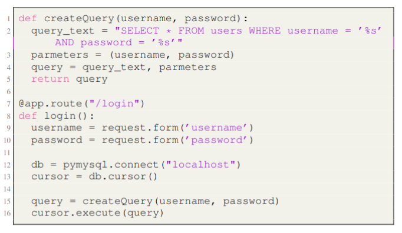

# 🔐 Flask Login App – SQL Injection Demo

This project demonstrates a basic Flask login app connected to MySQL, intentionally using **insecure raw SQL queries** to show how **SQL Injection** works.

Example was found in paper "[LLMs Cannot Reliably Identify and Reason About Security Vulnerabilities (Yet?):
A Comprehensive Evaluation, Framework, and Benchmarks](https://arxiv.org/abs/2312.12575)".

The authors developed a benchmark and, as part of one of the experiments on understanding the presence of vulnerabilities, came to the conclusion that modern LLMs perform poorly on this task.

Example from the paper:




In this repository, I reproduced this example, implementing the logic for passing parameters in three variations:
- as in the paper (contains an error in passing a `tuple` from the request and parameters to `cursor.execute`, result `TypeError: can't concat tuple to bytes`)
- without the vulnerability (with the original bug fixed)
- with a vulnerability

I tested all three versions of the applications with the most primitive prompt:
> describe, does this code contain vulnerabilities? And give me a short summary why  
> ```
> {{code}}
> ```

And got the following results on the gpt-4 and gpt-4o models:
1) Both models were misled when given the code with the error from the paper.
2) and 3.: Both models gave correct answers in cases where the code was correct but contained vulnerabilities.

Hence, a dilemma arises, which often comes up when working with LLMs as code copilots:  
> If the question is asked directly: "is there a vulnerability (yes/no/don’t know) in the code?...", should the LLM also account for programmatic errors that would prevent the code from running?  
> Or should it assume that in at least one part, the code is correct, and answer the question as posed?  
> If so, is it obligated to make the same assumption as the user?  

Apparently not.

---

## 🧰 Tech Stack

- **Python 3**
- **Flask** – web framework
- **PyMySQL** – MySQL client
- **MySQL 8 (Dockerized)**
- **No ORM** (deliberately using raw SQL for vulnerability)

---

## 🐳 1. Start MySQL with Docker

```bash
docker run --name test-mysql \
  -e MYSQL_ROOT_PASSWORD=rootpass \
  -e MYSQL_DATABASE=testdb \
  -p 3306:3306 \
  -d mysql:8
```

---

## 🛠️ 2. Initialize the Database

Access MySQL inside the container:

```bash
docker exec -it test-mysql mysql -u root -p
```

Password: `rootpass`

Then run:

```sql
USE testdb;

CREATE TABLE users (
  id INT AUTO_INCREMENT PRIMARY KEY,
  username VARCHAR(100),
  password VARCHAR(100)
);

INSERT INTO users (username, password) VALUES
('alice', 'password123'),
('bob', 'secret');
```

---

## 🐍 3. Set Up Python Environment

```bash
python -m venv venv
source venv/bin/activate 
pip install flask pymysql flask_sqlalchemy
```

---

## 🚀 4. Run the App

```bash
python app.py
```

Visit: [http://127.0.0.1:5000/login](http://127.0.0.1:5000/login)

Try logging in with:

- Username: `alice`
- Password: `password123`

---

## 🧪 5. Test SQL Injection

This app is intentionally vulnerable to SQL injection.

### Working Injection Example:

- **Username:** `' OR 1=1 #`
- **Password:** anything

### Why this works:

The code builds this raw query:

```sql
SELECT * FROM users WHERE username = '' OR 1=1 # AND password = '...'
```

The `#` comments out the password check, allowing unauthorized access.

---

## 🔒 6. What You Should Never Do in Production

- ❌ Never build SQL queries using string formatting
- ✅ Use parameterized queries or an ORM like SQLAlchemy
- ✅ Escape user input if absolutely necessary

---

## 🧼 Want to Fix It?

Just rewrite the query securely using parameters:

```python
cursor.execute("SELECT * FROM users WHERE username = %s AND password = %s", (username, password))
```

This version prevents all injection attacks like `' OR 1=1 #`.

---

## ✅ License

MIT License — for educational purposes.
